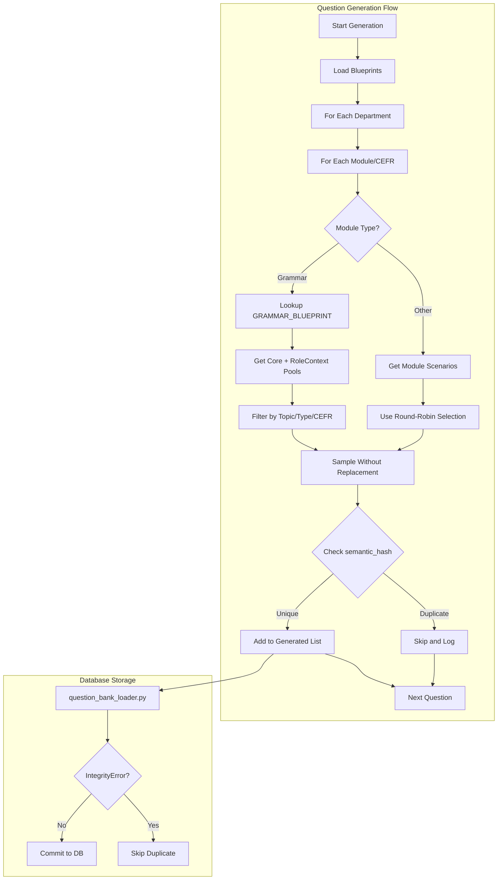

# Question Bank Deduplication and Enhancement Plan

This plan addresses the root causes of question duplication identified in the assessment system and implements the "best approach" for English assessment question generation.

## Problem Summary

1. **Grammar questions are identical across ALL departments** - The `_get_grammar_scenarios` function uses a single universal `grammar_pool`, ignoring department-specific content
2. **Grammar questions repeat within the same department** - `random.choice` samples with replacement from a small pool, causing frequent repetition (e.g., external_id 1441, 1442, 1443 all have identical content)
3. **Listening questions also use `random.choice`** - Same sampling-with-replacement issue
4. **No semantic deduplication at source** - Deduplication only happens at exam runtime via `_question_content_key`, not during generation

## Solution Architecture



## Phase 1: Database Schema Changes

### File: [src/main/python/models/assessment.py](src/main/python/models/assessment.py)

Add three new fields to the `Question` model:

| Field | Type | Purpose |
|-------|------|---------|
| `semantic_hash` | String(64), unique, not null, indexed | SHA256 hash of normalized question content for deduplication |
| `grammar_type` | String(50), nullable, indexed | "Core" (universal) or "RoleContext" (department-specific) |
| `grammar_topic` | String(100), nullable, indexed | Grammar point category (e.g., "Modal Verbs", "Present Perfect") |

**Code to add after existing fields:**

```python
# Semantic deduplication
semantic_hash = Column(String(64), unique=True, nullable=False, index=True)

# Grammar classification (only for Grammar module)
grammar_type = Column(String(50), nullable=True, index=True)  # "Core" or "RoleContext"
grammar_topic = Column(String(100), nullable=True, index=True)  # e.g., "Modal Verbs"
```

**Add to `__table_args__`:**

```python
UniqueConstraint('semantic_hash', name='uq_questions_semantic_hash'),
Index('ix_questions_grammar_classification', 'grammar_type', 'grammar_topic', 'cefr_level'),
```

## Phase 2: Create Question Blueprints Configuration

### New File: [src/main/python/config/question_blueprints.py](src/main/python/config/question_blueprints.py)

Define explicit quotas for grammar questions by CEFR level, type, and topic:

```python
from typing import Dict

GRAMMAR_BLUEPRINT: Dict[str, Dict[str, Dict[str, int]]] = {
    "A1": {
        "Core": {
            "Present Simple": 2,
            "To Be Verb": 2,
            "Articles": 1,
            "Basic Modals": 1,
        },
        "RoleContext": {
            "Polite Requests": 2,
        }
    },
    "A2": {
        "Core": {
            "Past Simple": 2,
            "Present Continuous": 1,
            "Modals Can/Must": 2,
        },
        "RoleContext": {
            "Service Language": 2,
        }
    },
    # ... B1, B2, C1, C2 definitions
}
```

## Phase 3: Question Generation Logic Changes

### File: [src/main/python/data/generate_question_bank.py](src/main/python/data/generate_question_bank.py)

### 3.1 Add Semantic Hash Calculation

```python
import hashlib
import json

def _calculate_semantic_hash(self, question_data: Dict[str, Any]) -> str:
    """Calculate SHA256 hash of normalized question content."""
    options_sorted = sorted(question_data.get('options', [])) if question_data.get('options') else []
    content = {
        "question_text": question_data["question"],
        "options": options_sorted,
        "correct_answer": question_data["correct"],
    }
    return hashlib.sha256(json.dumps(content, sort_keys=True).encode('utf-8')).hexdigest()
```

### 3.2 Add Deduplication Check

```python
def __init__(self, db_session):
    # ... existing init ...
    self._generated_hashes = set()  # Track generated question hashes

def _add_question_if_unique(self, question_obj: Question, question_data: Dict) -> bool:
    """Add question only if semantic hash is unique."""
    semantic_hash = self._calculate_semantic_hash(question_data)
    if semantic_hash in self._generated_hashes:
        self.logger.info(f"Skipping duplicate: {question_obj.department}/{question_obj.module_type}")
        return False
    question_obj.semantic_hash = semantic_hash
    self._generated_hashes.add(semantic_hash)
    return True
```

### 3.3 Implement Two-Layered Grammar Pools

Refactor `_get_grammar_scenarios` to load from two separate pools:

```python
def _load_grammar_pools(self):
    """Load core and role-context grammar pools."""
    self.core_grammar_pool = [
        {"cefr_band": "basic", "question": "...", "grammar_topic": "Present Simple", "grammar_type": "Core"},
        # ... universal grammar questions
    ]
    self.role_context_grammar_pools = {
        "Food & Beverage": [
            {"cefr_band": "basic", "question": "...", "grammar_topic": "Service Language", "grammar_type": "RoleContext"},
        ],
        # ... department-specific pools
    }

def _get_grammar_scenarios(self, department: str, cefr_level: str, 
                           grammar_type: str = None, grammar_topic: str = None) -> List[Dict]:
    """Get grammar scenarios with optional filtering."""
    scenarios = []
    
    # Always include core grammar
    scenarios.extend(self._filter_by_band(self.core_grammar_pool, cefr_level))
    
    # Add role-context if department has specific pool
    content_pool = DEPARTMENT_TO_CONTENT_POOL.get(department)
    if content_pool in self.role_context_grammar_pools:
        scenarios.extend(self._filter_by_band(
            self.role_context_grammar_pools[content_pool], cefr_level
        ))
    
    # Apply filters
    if grammar_type:
        scenarios = [s for s in scenarios if s.get("grammar_type") == grammar_type]
    if grammar_topic:
        scenarios = [s for s in scenarios if s.get("grammar_topic") == grammar_topic]
    
    return scenarios
```

### 3.4 Blueprint-Based Question Drawing

Replace `random.choice` with blueprint-driven sampling without replacement:

```python
from config.question_blueprints import GRAMMAR_BLUEPRINT

def _generate_grammar_questions_for_department(self, department: str) -> List[Question]:
    """Generate grammar questions using blueprint."""
    questions = []
    
    for cefr_level, type_topics in GRAMMAR_BLUEPRINT.items():
        for grammar_type, topics in type_topics.items():
            for grammar_topic, count in topics.items():
                pool = self._get_grammar_scenarios(
                    department, cefr_level, grammar_type, grammar_topic
                )
                random.shuffle(pool)  # Shuffle once for this bucket
                
                for i in range(min(count, len(pool))):
                    scenario = pool[i]  # Sample without replacement
                    question = self._create_grammar_question(department, cefr_level, scenario)
                    if self._add_question_if_unique(question, scenario):
                        questions.append(question)
                
                if len(pool) < count:
                    self.logger.warning(
                        f"Pool exhausted: {department}/{cefr_level}/{grammar_type}/{grammar_topic} "
                        f"needed {count}, got {len(pool)}"
                    )
    
    return questions
```

### 3.5 Update Listening to Use Round-Robin

Change `_get_listening_scenarios` from `random.choice` to `_pick_scenario`:

```python
def _generate_listening_question(self, department: str, cefr_level: str) -> Optional[Question]:
    scenario_key = DEPARTMENT_TO_CONTENT_POOL.get(department)
    key = f"listening_{scenario_key}_{cefr_level}"
    
    # Use round-robin instead of random.choice
    scenario = self._pick_scenario(self._get_listening_pool(scenario_key, cefr_level), key)
    if not scenario:
        return None
    
    question = Question(
        module_type=ModuleType.LISTENING,
        # ... other fields
    )
    if self._add_question_if_unique(question, scenario):
        return question
    return None
```

## Phase 4: Database Loader Error Handling

### File: [src/main/python/data/question_bank_loader.py](src/main/python/data/question_bank_loader.py)

Add graceful handling for semantic hash duplicates:

```python
from sqlalchemy.exc import IntegrityError

def load_full_question_bank(db_session: Session, questions: List[Question], clear_first: bool = False):
    added = 0
    skipped = 0
    
    for question in questions:
        try:
            db_session.add(question)
            db_session.flush()
            added += 1
        except IntegrityError:
            db_session.rollback()
            logger.warning(f"Duplicate skipped: {question.question_text[:50]}...")
            skipped += 1
    
    db_session.commit()
    logger.info(f"Loaded {added} questions, skipped {skipped} duplicates")
```

## Phase 5: Database Migration

Run Alembic migration after schema changes:

```bash
cd src/main/python
alembic revision --autogenerate -m "Add semantic_hash and grammar classification"
alembic upgrade head
```

## Expected Outcomes

| Issue | Before | After |
|-------|--------|-------|
| Cross-department grammar duplicates | 100% identical | Core questions shared, RoleContext unique per department |
| Intra-department grammar duplicates | High repetition (random.choice) | Zero duplicates (semantic_hash + blueprint) |
| Listening duplicates | High repetition | Reduced (round-robin selection) |
| Question traceability | None | semantic_hash enables tracking |
| Grammar coverage | Random topics | Balanced coverage via blueprint |

## File Change Summary

| File | Change Type | Description |
|------|-------------|-------------|
| `src/main/python/models/assessment.py` | Modify | Add 3 new fields + constraints |
| `src/main/python/config/question_blueprints.py` | Create | Blueprint configuration |
| `src/main/python/data/generate_question_bank.py` | Modify | Major refactor of generation logic |
| `src/main/python/data/question_bank_loader.py` | Modify | Add IntegrityError handling |
